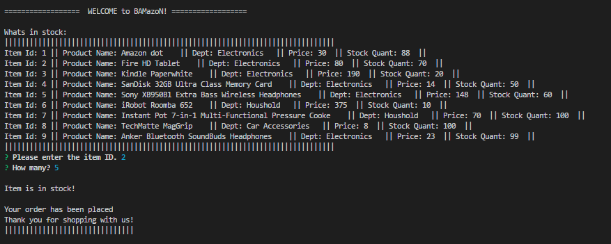
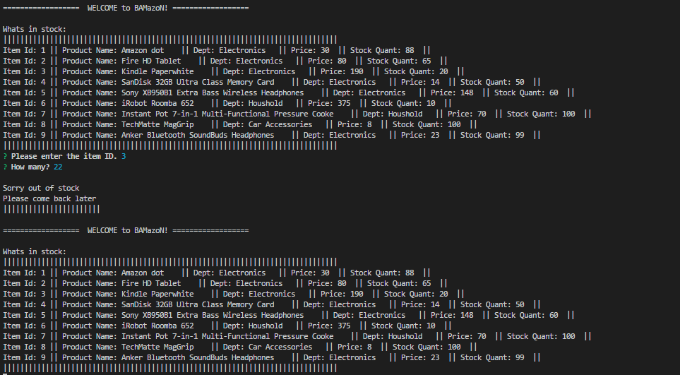

A CLI ordering dodad!
Which doesn't do anything just shows that I kinda get MySQL

Run the included program through nodejs. 
It will give you a list of items to purchase. 
Then it will ask you which you would like to purchase. 
If you choose wisely, it will ask you how many you'd like. 
  If you choose a valid quantity to order, your order will placed and you will be given your total 
If you choose poorly, it will say out of stock .

this shows how it runs after start

shows the inventorty, along with completed purschase.

this shows when you order too much it loops back to prompt user to try again

